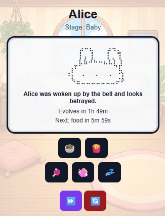

# Tomogachi

**Tomogachi** is a simple virtual pet game built as a Chrome extension inspired by the classic 90's toy. Designed to be a light companion game that can run quietly in the background while you work or study, take care of your tiny browser companion by feeding it, playing with it, cleaning it, putting it to sleep, and helping it grow from an egg into an adult. It does not demand constant attention, giving the player a quick moment of focus reset without becoming a major distraction. Because it lives inside the browser as a Chrome extension, Tomogachi stays easily accessible during everyday computer use while still remaining small, simple, and unobtrusive. In today's age, with so much i.a., everyone can afford to spend a little more ram, am I right? But, i mean... it's cheaper than an actual irl friend, i guess.

## Screenshot

## How to add to you chromium based web browser:

[Chrome Web Store link](https://chromewebstore.google.com/detail/tomogachi/jlnbolmllmgflbhambgcoepphfcehpjn)

## How to Run Locally
I am not sure why anyone would want this, but here it is:
1. Download or clone this repository.
2. Open Google Chrome.
3. Go to: chrome://extensions
4. Turn on **Developer mode**.
5. Click **Load unpacked**.
6. Select the project folder.
7. Click the extension icon to open Tomogachi.

## Technologies Used
* HTML
* CSS
* JavaScript
* Chrome Extensions Manifest V3
* Chrome Storage API
* Chrome Alarms API
* Chrome Action Badge API

## Current Status
This project is still in development.
